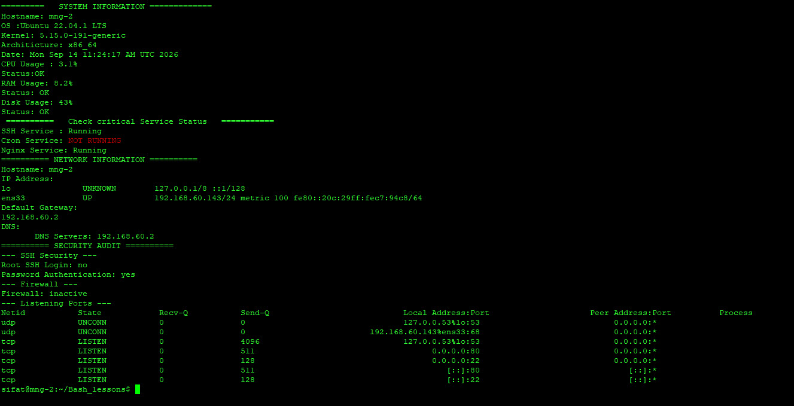

# Linux Monitoring Toolkit

A Bash-based Linux monitoring and security auditing toolkit for checking the health, services, network configuration, and basic security status of a Linux server.

## Features

### System Monitoring

* Hostname
* Operating system
* Kernel version
* CPU usage
* RAM usage
* Disk usage
* System date

### Service Monitoring

Checks the status of critical services:

* SSH
* Cron
* Nginx

### Network Information

* Hostname
* IP address
* Default gateway
* DNS server

### Security Audit

* SSH root login configuration
* SSH password authentication
* Firewall status
* Listening network ports

## Requirements

* Linux operating system
* Bash
* `systemctl`
* `ip`
* `df`
* `ss`
* `awk`
* `lastb`

Tested on Ubuntu/Debian-based Linux systems.

## Installation

Clone the repository:

```bash
git clone https://github.com/sifatullahabdulrahimzai/linux-monitoring-toolkit.git
cd linux-monitoring-toolkit
```

Make the script executable:

```bash
chmod +x linux-monitoring-toolkit.sh
```

## Usage

Run the toolkit:

```bash
./linux-monitoring-toolkit.sh
```

Some security checks may require `sudo` privileges.

## Example Output


## Author

**Sifatullah Abdulrahimzai**

Linux System Administrator


